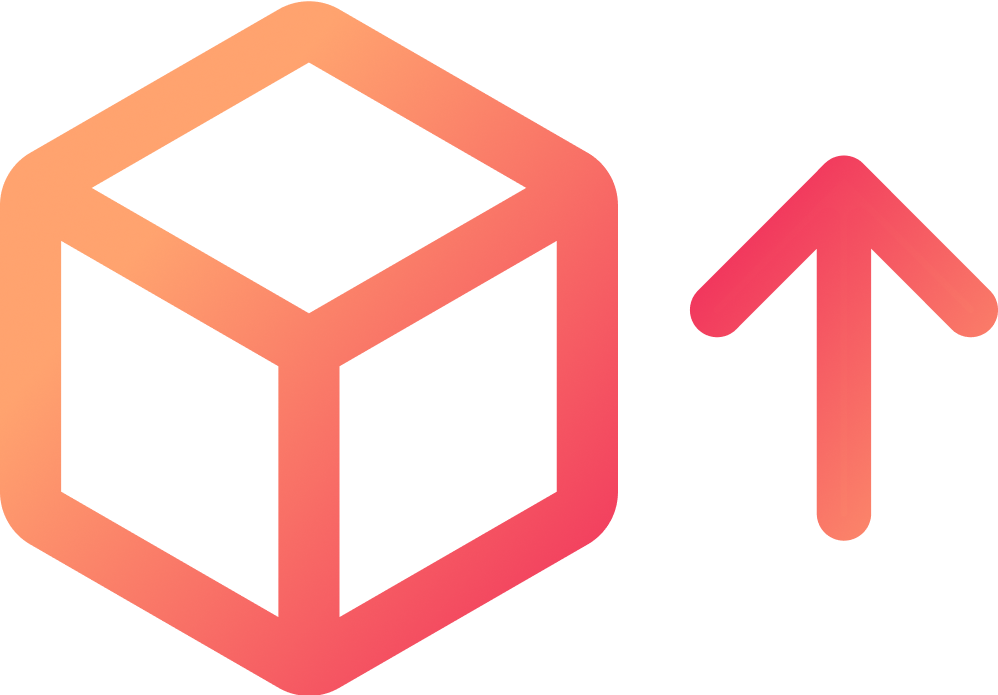

# NPM Bumper

[![License][license-badge]][license-url]
[![semantic-release][semantic-release-badge]][semantic-release-url]
[![Conventional Commits][conventional-commits-badge]][conventional-commits-url]
<br />

[![Production][actions-badge]][actions-url]
[![CodeFactor Grade][codefactor-badge]][codefactor-url]
[![GitHub release (latest by date)][github-releases-badge]][github-releases-url]

<!-- PROJECT LOGO -->
<br />
<p align="center">
  <a href="#">
    
  </a>

  <h3 align="center">NPM Dependency Bumper</h3>
  <p align="center"><a href="https://marketplace.visualstudio.com/items?itemName=ayushm.npm-bumper">Install.</a></p>
  <p align="center">
   A <a href="https://marketplace.visualstudio.com/items?itemName=ayushm.npm-bumper">VSCode extension</a> that bumps the versions of your dependencies and devDependencies in <code>package.json</code>.
  </p>
</p>

## Table of Contents

- [About](#about)
- [Usage](#usage)
- [How it works](#how-it-works)
- [Contributing](#contributing)
- [Reporting issues and bugs](#report-issues)
- [License](#license)
- [Contact](#contact)


## About

Update your dependencies and devDependencies in `package.json` with a single click of a button.

## Usage

1. Install
```bash
ext install ayushm.npm-bumper
```
2. Open a project with a `package.json` file
3. Click the bump dependencies icon in the status bar that looks like this,

<p align="center">
	
</p>

4. ???
5. Profit

**Note:** At the moment, the undo functionality is broken, however it is under active development. Until then, this extension will create a backup file named `package.backup.json`, just in case you don't like the output. Please delete the file if you do not need it.

## How it works

  1. Scans package.json for dependencies
  2. Retrieves the latest versions from the npm registry
  3. Rewrites package.json with the updated versions

You can view the source code on [GitHub](https://github.com/PrunedNeuron/npmbumper).

## Contributing

Contributions are what make the open source community such an amazing place to learn, inspire, and create. Any contributions you make are **greatly appreciated**.

1. Fork the Project
2. Create your Feature Branch<br>
  `git checkout -b feature/AmazingFeature`
3. Commit your Changes<br>
  `git commit -m 'feature: Add some AmazingFeature'`
4. Push to the Branch<br>
  `git push origin feature/AmazingFeature`
5. <a href="https://help.github.com/en/github/collaborating-with-issues-and-pull-requests/creating-a-pull-request">Open a Pull Request</a>

**Note:** If possible, please follow the [conventional-commits](https://www.conventionalcommits.org/) specification while committing and creating pull requests since it helps keep everything consistent.

## Report issues

Feel free to open a [new issue](https://github.com/PrunedNeuron/npmbumper/issues/new) on GitHub with information about what went wrong, what you expected and if possible, a screenshot or a description of the problem you faced.

## License

Distributed under the MIT License.
<br />
See <a href="LICENSE.md">`LICENSE`</a> for more information.


## Contact

Email - [am@ayushm.dev](mailto:am@ayushm.dev)<br/>
Dribbble - [dribbble.com/ayush](https://dribbble.com/ayush)<br/>
Website - [ayushm.dev](https://ayushm.dev)<br/>
Github - [PrunedNeuron](https://github.com/PrunedNeuron)

<!-- Links -->
[license-badge]: https://img.shields.io/github/license/PrunedNeuron/npmbumper
[actions-badge]: https://github.com/PrunedNeuron/npmbumper/workflows/.github/workflows/production.yml/badge.svg
[codefactor-badge]: https://img.shields.io/codefactor/grade/github/PrunedNeuron/npmbumper
[marketplace-url]: https://marketplace.visualstudio.com/items?itemName=ayushm.npm-bumper
[semantic-release-badge]: https://img.shields.io/badge/%20%20%F0%9F%93%A6%F0%9F%9A%80-semantic--release-e10079.svg
[semantic-release-url]: https://github.com/semantic-release/semantic-release
[conventional-commits-badge]: https://img.shields.io/badge/Conventional%20Commits-1.0.0-yellow.svg
[conventional-commits-url]: https://www.conventionalcommits.org/
[github-releases-badge]: https://img.shields.io/github/v/release/PrunedNeuron/npmbumper
[codefactor-url]: https://www.codefactor.io/repository/github/prunedneuron/npmbumper
[github-releases-url]: https://github.com/PrunedNeuron/npmbumper/releases
[license-url]: https://github.com/PrunedNeuron/npmbumper/blob/master/LICENSE.md
[actions-url]: https://github.com/PrunedNeuron/npmbumper/actions?query=workflow%3A.github%2Fworkflows%2Fproduction.yml